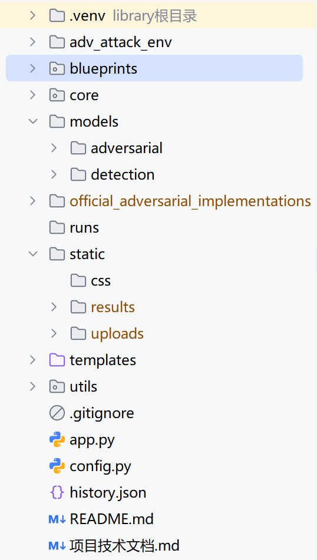
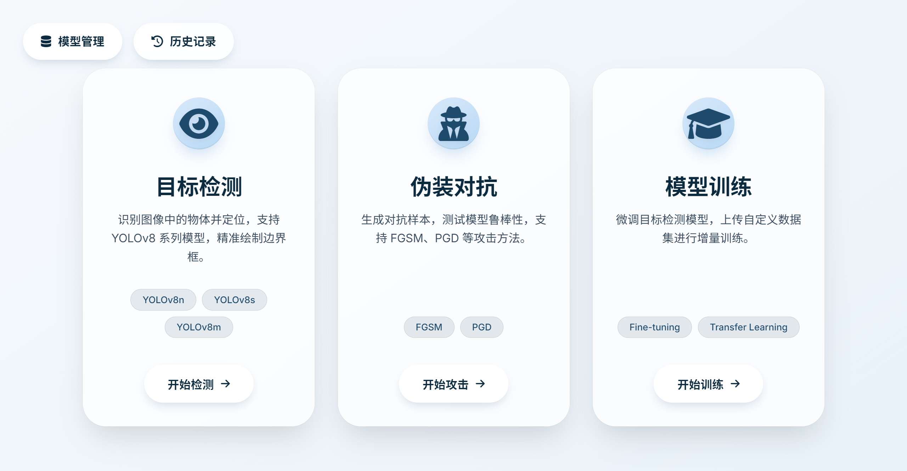
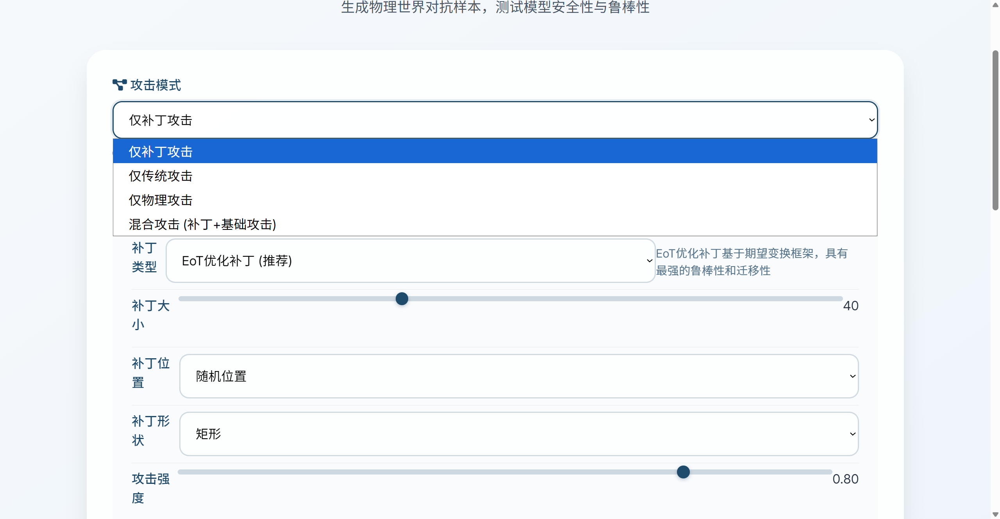
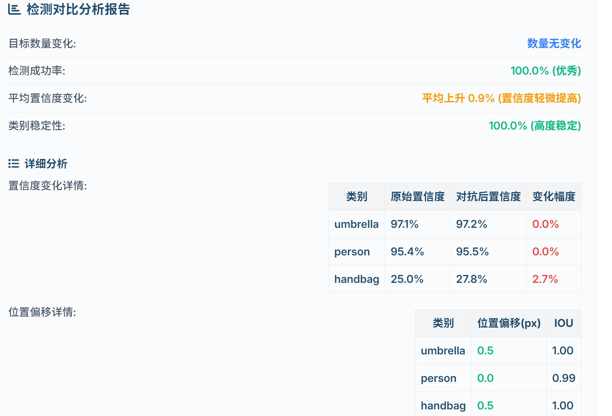
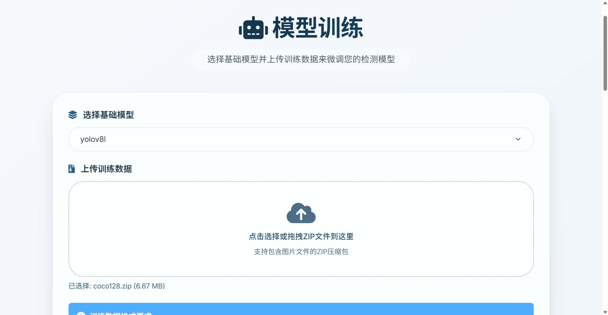
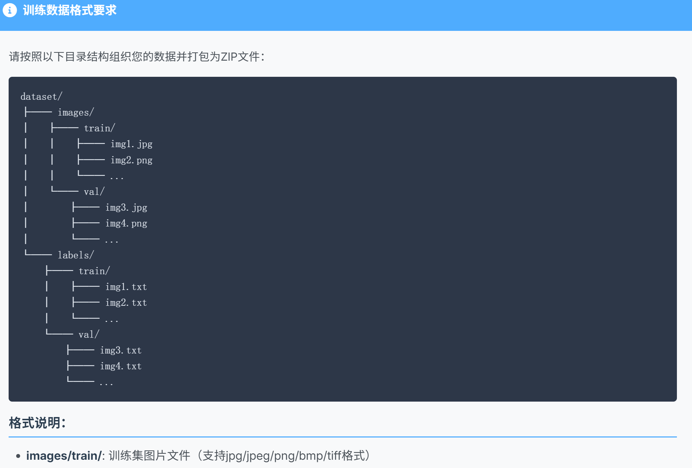
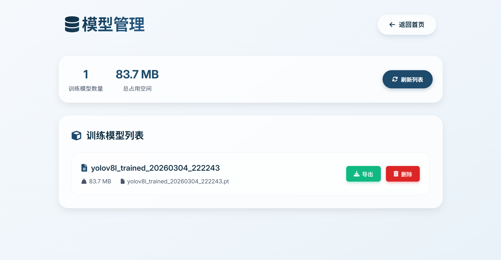
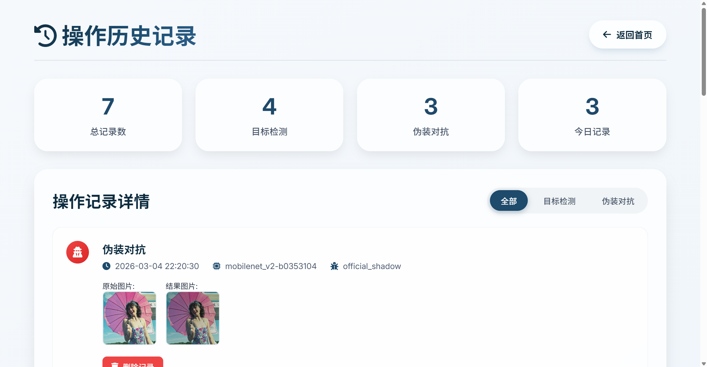

完整项目结构如上图

使用目标检测功能的时候需要引入yolov8模型，模型放置位置，flaskProject/models/detection/yolov8m.pt
一次可放置多个模型，项目会自动检测并使用
同理，使用伪装对抗功能也要引入相关模型，模型放置位置，flaskProject/models/adversarial/resnet50.pt

项目功能演示：
    
    
    
    
    
    
    
    
    
    
    

声明：本项目为学习项目，仅供学习使用，请勿用于商业用途。